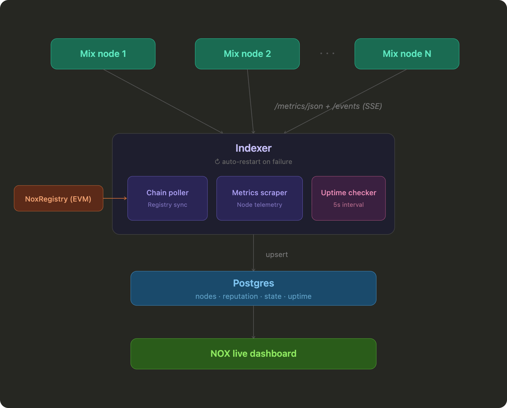

# Nox Indexer

Indexes mix nodes registered on the NoxRegistry contract. Polls the chain for registrations, scrapes node metrics over SSE, tracks uptime with an EMA score, and serves everything over HTTP + WebSocket.



## Setup

**Prerequisites:** Rust 1.75+ and PostgreSQL 14+

```bash
docker run -d --name nox-postgres -p 5432:5432 \
  -e POSTGRES_DB=indexer -e POSTGRES_HOST_AUTH_METHOD=trust \
  postgres:17-alpine

# configure
cp .env.sample .env

# run
cargo run
```

tables are created automatically on first run.

## Config

All options are configurable via env vars or CLI flags. See `.env.sample` for defaults.

| Variable | Description | Required |
|----------|-------------|----------|
| `REGISTRY_ADDRESS` | NoxRegistry contract address | Yes |
| `ETH_RPC_URL` | RPC endpoint | Yes (testnet/mainnet) |
| `DATABASE_URL` | Postgres connection string | Yes |
| `NETWORK` | `localtestnet`, `testnet`, or `mainnet` | No |
| `FROM_BLOCK` | Exact current NoxRegistry deployment block | Yes |

## API

```
GET  /v1/state        nodes + metrics + events + reputation
GET  /v1/reputation   uptime rankings
GET  /seed/topology   chain-pinned SDK topology snapshot
GET  /healthz         returns 200 if db is up
WS   /v1/live         pushes CLUSTER / METRICS / EVENT messages
```

`/seed/topology` returns schema version 2. Its `nodes` array contains every registered member replayed from
the configured deployment block, with profiles read at one processed chain block. `liveness` is a separate
online/offline observation for the same complete member set. The endpoint returns 503 when replayed addresses
cannot prove the registry count and fingerprint at that block; database rows alone are never used as topology
authority.

## Docker

```bash
docker build -t nox-indexer .
docker run -d -p 4000:4000 --env-file .env nox-indexer
```

## Reputation Scoring

Node uptime is tracked via an exponential moving average (EMA) computed every check interval (default: 60s). Scores range from 0 to 100 based on `/metrics/json` endpoint availability.

| Parameter | Value |
|-----------|-------|
| Alpha (α) | 0.01 |
| Responsive sample | 100 |
| Unresponsive sample | 0 |
| Stale penalty (>6h without check) | 5% per round |

New nodes initialize from their first check result. Deregistered nodes are excluded from rankings.

## License

[MIT](./LICENSE)
