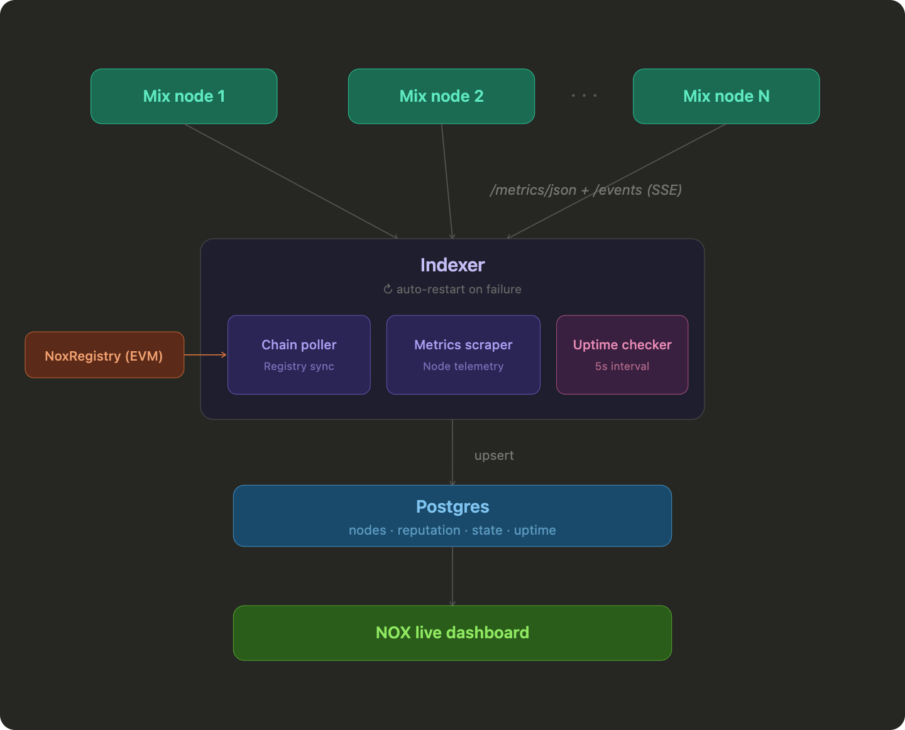

# Nox Indexer

Indexes mix nodes registered on the NoxRegistry contract. Polls the chain for registrations, scrapes node metrics over SSE, tracks uptime with an EMA score, and serves everything over HTTP + WebSocket.



## Setup

**Prerequisites:** Rust 1.88+ (the Dockerfile toolchain) and PostgreSQL 14+

```bash
docker run -d --name nox-postgres -p 5432:5432 \
  -e POSTGRES_DB=indexer -e POSTGRES_HOST_AUTH_METHOD=trust \
  postgres:17-alpine

# configure
cp .env.sample .env

# run
cargo run
```

tables are created automatically on first run.

## Config

All options are configurable via env vars or CLI flags. See `.env.sample` for defaults.

| Variable | Description | Required |
|----------|-------------|----------|
| `REGISTRY_ADDRESS` | NoxRegistry contract address | Yes |
| `ETH_RPC_URL` | RPC endpoint, or a comma-separated failover list | Yes (testnet/mainnet) |
| `DATABASE_URL` | Postgres connection string | Yes |
| `NETWORK` | `localtestnet`, `testnet`, or `mainnet` | No |
| `FROM_BLOCK` | Exact NoxRegistry deployment block | Yes |
| `EXPECTED_CHAIN_ID` | Refuse to sync against any other chain | No |
| `CHAIN_CONFIRMATIONS` | Blocks behind head treated as final (default 20; 0 on localtestnet) | No |
| `LOG_CHUNK_SIZE` / `LOG_CHUNK_MIN` / `LOG_CHUNK_MAX` | `eth_getLogs` range: start, floor, ceiling | No |
| `ENTRY_POINT_ADDRESS` | NoxEntryPoint; turns on settlement indexing | No |
| `REWARD_POOL_ADDRESS` | NoxRewardPool; adds exit credit claims and pool balances (needs `ENTRY_POINT_ADDRESS`) | No |
| `SETTLEMENT_FROM_BLOCK` | First block scanned for settlements (default `FROM_BLOCK`) | No |
| `HEALTH_MAX_SYNC_AGE_SECS` | Sync age above which `/healthz/sync` returns 503 (default 300) | No |
| `ALLOW_PRIVATE_NODE_ADDRESSES` | Poll loopback/private node addresses outside localtestnet (default false) | No |
| `RUST_LOG` | Log filter (default `info`) | No |

Arbitrum Sepolia (live): `REGISTRY_ADDRESS=0xF7BFf88A1412054a001Dc4b8aCBddAd6F9b26cB6`,
`FROM_BLOCK=312414608`, `EXPECTED_CHAIN_ID=421614`,
`ENTRY_POINT_ADDRESS=0xad911Ca217C6dC779fCE6A6538bDda3071c38E7E`,
`REWARD_POOL_ADDRESS=0xA487BAa4f2C3fAA01C70066EE88b6F7fD6f1361D`.

If Postgres is unreachable at boot, the connection is retried with backoff (1s up to 30s)
instead of exiting.

### Chain sync

- Progress is checkpointed per `(chain_id, registry_address)` in `indexer_checkpoints`. A restart
  resumes after the checkpoint; a registry with no checkpoint is replayed from `FROM_BLOCK`.
- Every sync ends by checking the replayed member set against the registry's `relayerCount()` and
  `topologyFingerprint()`. A resumed set that disagrees falls back to a full replay.
- Failed syncs are retried forever with jittered exponential backoff (2s up to 5min); progress
  made before the failure is kept. `eth_getLogs` ranges shrink on range and rate-limit errors
  and grow back after successes.
- RPC endpoints fail over in order on transport errors, timeouts, 429s, range limits and missing
  state; the endpoint that last worked is tried first. Logs show only endpoint hosts.
- Switching `REGISTRY_ADDRESS` marks every node that is not a member of the new registry
  `deregistered`. Stats (`node_reputation`, `node_metric_offsets`) are keyed by address and kept,
  so a node that registers again resumes its counters.
- Both `relayers()` layouts are decoded: the April 2026 7-field registry and the 9-field UUPS
  registry (`status`, `frozen`).
- To force a full replay: `DELETE FROM indexer_checkpoints WHERE registry_address = '<lowercase registry>';`
  then restart.
- A registry upgrade that changes the `relayers()` layout must ship with an indexer release that
  decodes it. Until then sync retries forever, `indexer.last_error` reads "registry layout not
  supported by this indexer version", `/healthz/sync` returns 503 and `/seed/topology` returns 503
  once its cached snapshot is older than 10 minutes.

### Node polling

Admin URLs are derived from each registered multiaddr (P2P port + 1). Outside localtestnet only
publicly routable unicast IPs are polled, and redirects are never followed; a node registered
with any other address shows an empty `admin_url` and is not scraped. Subscriptions restart
when a node's registered URL changes.

### Settlements

With `ENTRY_POINT_ADDRESS` set, `PaidExecutionSettled` logs (and, with `REWARD_POOL_ADDRESS`,
`ExitCreditClaimed` logs) are stored in `paid_settlements` / `exit_credit_claims`, checkpointed
in `settlement_checkpoints` and polled every 60s. After new events, and at least every 10
minutes, per-exit totals are recomputed and the pool is read on chain at the last stored block
(`claimableExit` per exit and asset; `totalCollected`, `totalDistributed`, `networkOutstanding`,
`exitOutstanding` per asset). Amounts are token base units as decimal strings. To rescan:
`DELETE FROM settlement_checkpoints;` then restart (stored rows are deduplicated by log).

## API

```
GET  /v1/state        nodes + metrics + events + reputation + network totals + sync status
GET  /v1/reputation   uptime rankings (registered nodes only)
GET  /seed/topology   chain-pinned SDK topology snapshot
GET  /v1/settlements   paid execution totals, pool balances, recent settlements and claims (?limit=1..500)
GET  /healthz         200 if db is up; body includes chain sync status
GET  /healthz/sync    200 only if db is up and chain sync is live, verified and fresh (for uptime monitors)
WS   /v1/live         pushes CLUSTER / METRICS / EVENT messages
```

`/v1/state` fields beyond the per-node data:

| Field | Meaning |
|-------|---------|
| `network_totals` | Lifetime counters (`packetsReceived`, `packetsForwarded`, ...) summed over every node ever scraped, registered or not, plus `scrapedNodeCount` (how many nodes feed the totals; not the registered count, which is `nodes.length`) |
| `network_genesis_ms` | Earliest uptime-check evidence (Unix ms), estimated once as `last_check_ms - total_checks * interval` |
| `network_reputation_avg` | Mean reputation of registered nodes only |
| `network_totals.cumulativeMaximumCostUsdIsLowerBound` | Always `true`: node versions from before `cumulativeMaximumCostUsd` existed banked 0 for it, so the total can be below `cumulativeCostUsd`. Do not quote it as a maximum |
| `indexer` | Sync `phase` (`starting`, `syncing`, `retrying`, `live`), `chain_id`, `registry_address`, `last_block`, `head_block` (safe head at the last poll), `verified`, `attempts`, `last_error` (a coarse category such as `rpc rate limited`; the full error is only in the logs), `last_synced_at_ms` (last poll that reached the safe head; its age is the sync lag) |
| `settlements` | Settlement indexing summary: `enabled`, contract addresses, `last_block`, `executions`, per-exit `exits` (`executions`, `exit_fees`, `network_fees`, `claimed`, on-chain `claimable`), per-asset `pool` balances read at `pool_read_block` |

Node `buildVersion` comes from the metrics JSON when present, otherwise from the node's
`x-nox-version` response header.

Nodes carry `frozen`: a frozen node is still a registry member but must not be routed through.

`/seed/topology` returns schema version 2. Its `nodes` array contains every registered member,
with profiles read at the last processed block (a few seconds behind head), and its count and
fingerprint are checked against the registry at that block. `liveness` is a separate
online/offline observation for the same member set; frozen members stay in `nodes` (the
fingerprint includes them) but are always `offline`. Snapshots are cached for 30s and rebuilt
when membership changes; the endpoint returns 503 until the first sync completes or when the
registry cannot be read.

## Monitoring

Point an external uptime monitor at `GET /healthz/sync` (1-5 minute interval, alert after two
failures). It returns 503 with an `error` reason when Postgres is down, when the chain sync is not
live, when the membership check disagrees with the registry, or when no poll has reached the safe
head for `HEALTH_MAX_SYNC_AGE_SECS`; `sync_age_secs` in the body is the current lag. A second
check on `GET /seed/topology` (expect 200) covers the endpoint SDK clients use.

`/healthz` stays the platform healthcheck: it only needs Postgres, so a long replay after a
deploy does not fail it.

## Backups

Railway snapshots the Postgres volume. For an off-platform copy, periodically run `pg_dump` from
somewhere that can reach the database (for example a scheduled job on Railway using the private
`DATABASE_URL`) and store the dump outside Railway:

```bash
pg_dump --format=custom --no-owner "$DATABASE_URL" > nox-indexer-$(date -u +%F).dump
```

Everything except `node_reputation`, `node_metric_offsets` and `indexer_state` can be rebuilt
from the chain by deleting the checkpoints, so those three tables are the ones worth keeping.

## Docker

```bash
docker build -t nox-indexer .
docker run -d -p 4000:4000 --env-file .env nox-indexer
```

## Reputation Scoring

Node uptime is tracked via an exponential moving average (EMA) computed every check interval (default: 60s). Scores range from 0 to 100 based on `/metrics/json` endpoint availability.

| Parameter | Value |
|-----------|-------|
| Alpha (α) | 0.01 |
| Responsive sample | 100 |
| Unresponsive sample | 0 |
| Stale penalty (>6h without check) | 5% per round |

New nodes initialize from their first check result. Deregistered nodes are excluded from rankings and
their scores do not decay, so a node that registers again resumes its score.

## License

[MIT](./LICENSE)

`assets/GeoLite2-City.mmdb` is GeoLite2 data created by MaxMind, available from
[maxmind.com](https://www.maxmind.com), and is covered by the
[GeoLite2 EULA](https://www.maxmind.com/en/geolite2/eula), not by the MIT license.
